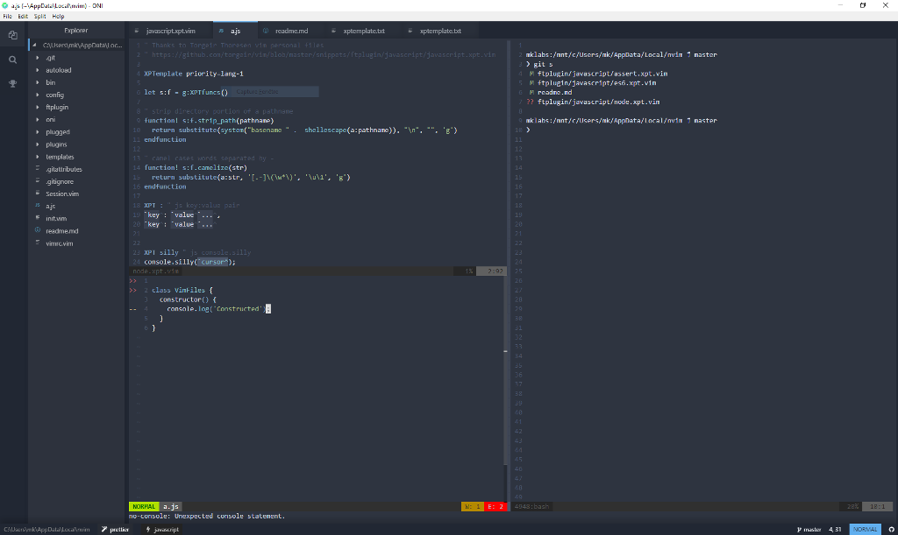

# vimfiles

This is my cross-platform, cross-editor `~/.vim` folder.

That being said, this repo is now tailored to work best with [Onivim](https://www.onivim.io).

## Description

- Works well on unix, and pretty fine on Windows
- Small set of [plugins](#plugins) for general development
- Modular nvim / vim and common [configuration](#configuration). Plugins'
  configurations are loaded from their respective files.

Here is how it looks with [Onivim](https://www.onivim.io) on Windows 10 and
[Windows Subsystem for
Linux](https://docs.microsoft.com/fr-fr/windows/wsl/about).



## Installation

Using Neovim: Clone to `~/.config/nvim`.
```sh
# osx / nix
$ git clone https://github.com/mklabs/vimfiles.git ~/.config/nvim
```

Using vim: Clone to `~/vimfiles` on windows, clone to `~/.vim` everywhere else.

Using onivim: Clone to `~/AppData/Local/nvim` on windows, and ignore the following Windows note.

**Windows Note**: You need to rename the ~/.vimrc to its windows equivalent
`~/_vimrc` & `~/_gvimrc` (a `_` instead of `.`). The colorscheme is left to
default and can be configured in `_vimrc` file.

**Fonts note**: In order for vim-devicons to work, you'll need to install
[Droid sans Mono nerd
font](https://github.com/ryanoasis/nerd-fonts#font-installation) and run `sudo fc-cache -f -v` (tested on Ubuntu)

### Plugin install

Once vim is started, run `:PlugInstall` or `:PlugUpdate`.

## Plugins

See [`config/plugins.vim`](./config/plugins.vim) to configure the list of plugins to install.

## Configuration

### vimrc

`init.vim` is just a symlink to `vimrc`. The first is used by neovim while the
latter is used by regular vim.

Common plugin and configurations are loaded with from within
[`./config`](./config) folder.

Default themse set to [Oceanic Next][] only for unix terminal or GUI environment.

#### ./config

- plugins.vim - vim-plug initialization and definitions of plugins used
- mappings.vim - contains most of the general keybindings (not plugin specific)
- autocmd.vim - Autocommand stuff to hook certain action on particular Vim events

#### ./plugins

- {pluginName}.vim - contains plugin specific configuration and mappings

#### Mappings

These mappings have been thought to work alongside Onivim's default one.

| Mapping              | Description                                 |
| ---------            | -------------                               |
| ,                    | Map Leader                                  |
| Shift Up             | Previous tab                                |
| Shift Down           | Next Tab                                    |
| Shift Left           | Previous Tab                                |
| Shift Right          | Next Tab                                    |
| Shift h              | Previous buffer                             |
| Shift l              | Next buffer                                 |
| Ctrl Left, Ctrl h    | Navigate to left window                     |
| Ctrl Right, Ctrl l   | Navigate to right window                    |
| Ctrl Down, Ctrl j    | Navigate to bottom window                   |
| Ctrl Up, Ctrl k      | Navigate to upper window                    |
| Ctrl o               | New tab                                     |
| ,,                   | Previous edited buffer                      |
| tt                   | Toggle comments                             |
| ,n                   | Opens VimFiler Explorer mode                |
| ,b                   | Opens VimFiler in current buffer            |
| Ctrl b               | Opens CtrlPBuffer                           |
| Tab (in insert mode) | Triggers emmet expand (when appropriate)    |
| ,f                   | Apply ALEFix with prettier (through eslint) |

## Snippets

Snippets are enabled and provided by [xptemplate](https://github.com/drmingdrmer/xptemplate).

The `ftplugin/*/*.xpt.vim` files are actually snippet definition files for
xptemplate. Feel free to browse them or edit them in your own fork.

In this repository, they're written using two-spaces indent with semi-colon.
Though it can be easily fixed after being replaced with tools like
[prettier](https://github.com/prettier/prettier)

Some snippets don't have semi colons as they are designed to be use, in some
place, where semi-colons are not desired. Such as `()` which expands to
anonymous arrow functions.

Right now, there's quite a few snippets tailored for JavaScript development
using es6 syntax and mocha definitions.

Also, huhe thanks to [torgeir/vim](https://github.com/torgeir/vim) for the
`req` snippet, which replace and strip down the basename part of the required
module. In addition to that, quite a few snippet (namely for mocha) have been
borrowed from his repository.

## Credits

It started as a fork of [quick-vim][], but have diverged quite a bit.

vim/gvim config files based on [janus][] config. A good amount of vim goodies
were also taken from Derek's [vim-config][]

**Thanks**: [quick-vim][], [vim-config][], [janus][], [nvie's vimrc][]

[vim-config]: https://github.com/derekwyatt/vim-config/
[janus]: http://github.com/carlhuda/janus
[quick-vim]: https://github.com/brianleroux/quick-vim/
[nvie's vimrc]: https://github.com/nvie/vimrc
